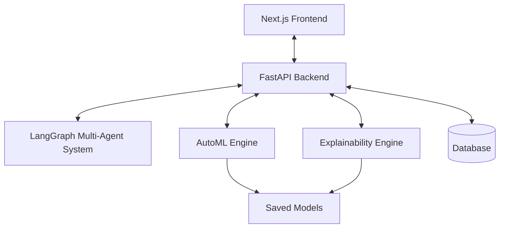

# NeuralForge AI Platform

NeuralForge is a state-of-the-art, production-ready Multi-LLM Agent Platform that coordinates specialized domain experts to guide ML professionals from problem formulation to containerized deployment.

## Core Features

- **Multi-Agent Orchestration**: 10 specialized LLM agents (Data Scientist, ML Engineer, DevOps, etc.) collaborate to solve complex problems.
- **Automated Data Cleaning**: Detect and handle missing values, duplicates, and outliers automatically.
- **AutoML Pipeline**: Automatically train, evaluate, and tune multiple models (XGBoost, Random Forest, LightGBM, etc.) to find the best performer.
- **Model Export & Deployment**: Download your model in 7+ formats (ONNX, joblib, PMML) or generate a complete deployment package (FastAPI, Docker, Streamlit).
- **Explainable AI (XAI) Playground**: Interactive simulator with SHAP, LIME, Decision Paths, and an AI Teacher Mode that explains predictions in plain English.
- **Training Transparency**: Generate comprehensive JSON/HTML/PDF reports detailing the exact data pipeline and model selection process.

## Architecture

NeuralForge uses a modern, scalable tech stack:

- **Frontend**: Next.js 14, React, TailwindCSS, Framer Motion
- **Backend**: FastAPI, Python 3.10+, SQLAlchemy, LangChain/LangGraph
- **Database**: SQLite (dev) / PostgreSQL (prod)
- **ML & XAI**: Scikit-Learn, XGBoost, LightGBM, SHAP, LIME
- **Infrastructure**: Docker, Docker Compose



## Installation & Setup

1. **Clone the repository**
   ```bash
   git clone https://github.com/your-org/NeuralForge.git
   cd NeuralForge
   ```

2. **Backend Setup**
   ```bash
   cd backend
   python -m venv venv
   source venv/bin/activate
   pip install -r requirements.txt
   uvicorn main:app --reload --port 8000
   ```

3. **Frontend Setup**
   ```bash
   cd frontend
   npm install
   npm run dev
   ```

4. **Access the Application**
   Open your browser and navigate to `http://localhost:3000`.

## Example Workflow

1. **Upload Dataset**: Upload a CSV file in the Datasets tab.
2. **Clean Data**: Use the Data Cleaning tool to automatically fix anomalies.
3. **Train Model**: Navigate to AutoML, select your target column, and let the agents find the best model.
4. **Explain**: Go to the XAI Playground, input sample data, and view SHAP values and natural language explanations.
5. **Deploy**: Download a full FastAPI + Docker deployment package from the Model Hub.

## Future Roadmap

- Deep Learning Support (PyTorch/TensorFlow integrations)
- Advanced NLP & Computer Vision Pipelines
- Kubernetes (K8s) deployment templates
- Real-time model monitoring and drift detection

## License

This project is licensed under the MIT License.
