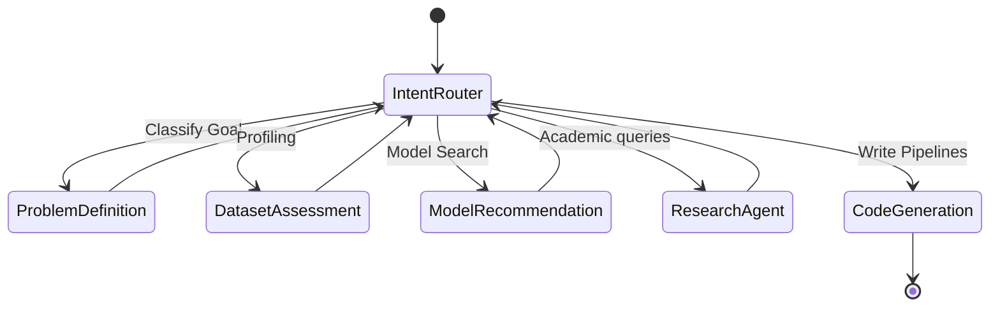

# NeuralForge System Architecture

This document describes the design patterns, data flows, and structural decisions behind NeuralForge.

---

## 1. High-Level Blueprint

NeuralForge separates client interactions, business hosting, and agent execution:

- **Client Layer (Next.js 16)**: Desktop-first, fully modular dark theme console. Renders stream blocks, CSV parsing metrics, and interactive correlation matrices. Communicates with backend using REST APIs and Server-Sent Events (SSE).
- **Backend Host (FastAPI)**: Asynchronous router that manages sessions, projects database entries, and streams responses.
- **Agent Coordination Layer (LangGraph)**: Maintains thread history using checkpoints. Evaluates prompts, matches intents, executes node callbacks, and runs mathematical search tools.

---

## 2. Stateful Multi-Agent Execution

NeuralForge orchestrates 10 specialized agent personas utilizing LangGraph's cyclical routing capabilities:

---

## 3. Database Persistence Schema

NeuralForge utilizes SQLAlchemy ORM with async PostgreSQL pools. Core database tables:

1. **Users**: Identifiers, emails, display names, and connected providers.
2. **Projects**: Name, descriptions, categories, configurations, and timestamps.
3. **Conversations**: Persists chat bubbles history list, last flow maps, and node parameters.
4. **Files**: Holds physical directory file paths, rows counts, and datatype dicts.
5. **ResearchResults**: Holds query criteria, pdf URLs, list of author papers, and citations.
